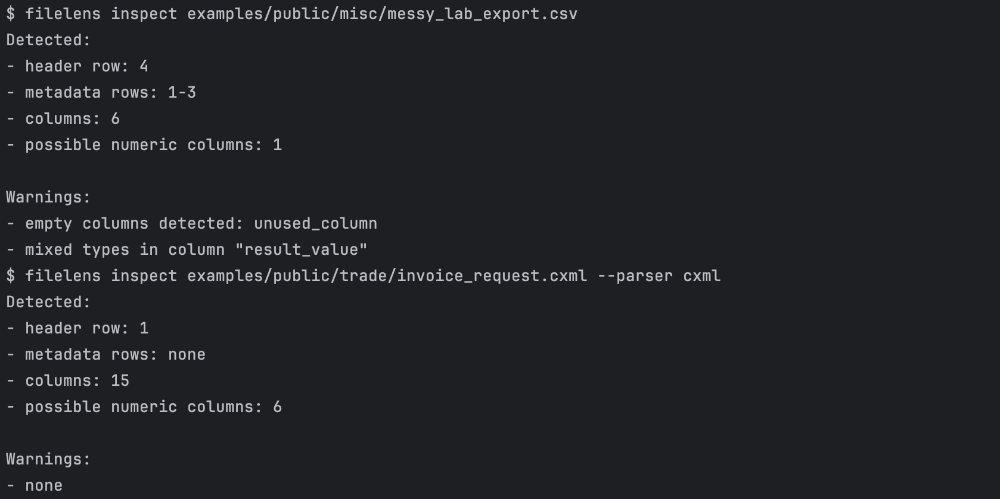
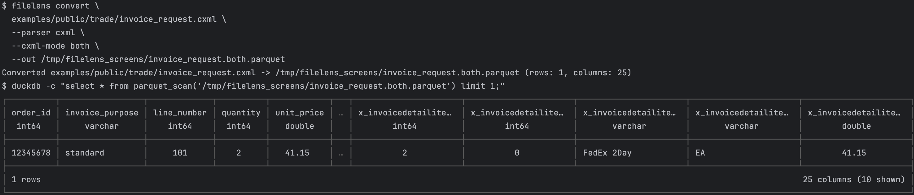

# filelens

Turn messy files into clean tables in one command.

filelens is a CLI that helps you understand and clean messy data files.
Most of the time, the hardest part is just understanding the file.

Ever opened a file where:
- headers start on row 6
- metadata is mixed with data
- columns are inconsistent

filelens lets you:
- inspect structure and issues
- infer a schema
- convert to a clean table (Parquet)

No config. No guessing. Deterministic output.
Built for real-world data engineering workflows.

## Quick start

```bash
pip install filelens
filelens inspect file.csv
filelens convert file.csv --out file.parquet
```

## Example

### Before

Metadata + mixed rows + unclear structure:

```csv
Metadata: Device=LabX
Date: 2024-01-01

Sample ID,Value,Unit
S1,0.45,mg/mL
S2,0.50,mg/mL
```

Inspect:

```bash
filelens inspect sample.csv
```


Output:

```text
Detected:
- header row: 4
- metadata rows: 1-3
- columns: 3

Warnings:
- none
```

### One command

```bash
filelens convert sample.cxml --out sample.parquet
```


What it does:
- detects structure
- skips metadata
- infers schema
- writes `sample.parquet`


### After

Clean table:

```sql
sample_id | value | unit
S1        | 0.45  | mg/mL
S2        | 0.50  | mg/mL
```

## That's it

For most use cases, you only need:

```bash
filelens inspect file.csv
filelens inspect file.cxml
filelens convert file.csv --out file.parquet
```

Everything below is optional (advanced formats, dbt integration, pipelines).

## Supported inputs

Supports common messy data formats used in analytics and healthcare.

- Excel / CSV (messy tabular files): `.xlsx`, `.xlsm`, `.xls`, `.csv`, `.tsv`, `.psv`, `.txt`
- JSON (nested data): `.json`, `.ndjson`
- XML (including cXML / CDA / NAACCR): `.xml`, `.cxml`, `.xcml`
- HL7 (basic extraction): `.hl7`, `.msg`
- Compressed text variants: `.gz` wrappers for supported text formats

## Design

- deterministic
- no config required
- optimized for messy real-world files

## When to use filelens

- You opened a file and do not understand its structure
- Your Excel export has metadata rows and broken headers
- You need to convert XML/JSON into a table quickly
- You want clean input for dbt or a data warehouse

## More examples

Inspect:

```bash
filelens inspect data/file.xlsx
filelens inspect data/order.cxml
filelens inspect data/patient-example.json
filelens inspect data/oru_r01.msg
filelens inspect data/clinical.xml
filelens inspect data/patient-example.ttl
filelens inspect data/patient-example.ttl.html
```

Schema:

```bash
filelens schema data/file.xlsx
filelens schema data/patient-example.json --parser fhir
```

Convert:

```bash
filelens convert data/file.xlsx --out data/file.parquet
filelens convert data/order.cxml --out data/order.parquet
filelens convert data/nested_lab_result.json --out data/nested_lab_result.parquet
filelens convert data/oru_r01.msg --out data/oru_r01.parquet
filelens convert data/patient-example.ttl --out data/patient-example.ttl.parquet
```

Optional parser override:

```bash
filelens inspect data/file.xml --parser cda
filelens inspect data/file.json --parser json
filelens inspect data/file.json --parser fhir
filelens inspect data/file.msg --parser hl7
filelens inspect data/file.ttl --parser rdf
```

CXML extraction mode:

cXML mode controls which columns are emitted:

- `mapped` (default): canonical columns only (`order_id`, `line_number`, `quantity`, ...)
- `auto`: extracted path-based columns only (`x_*`)
- `both`: union of `mapped` + `auto`

If you do not pass `--cxml-mode`, filelens uses `mapped`.

```bash
# curated canonical fields only
filelens schema data/order.cxml --parser cxml --cxml-mode mapped

# path-based auto-captured fields only (x_* columns)
filelens schema data/order.cxml --parser cxml --cxml-mode auto

# both canonical + path-based fields
filelens convert data/order.cxml --parser cxml --cxml-mode both --out data/order.parquet
```

If running from source, use `./target/release/filelens` instead of `filelens`.

## Optional: use with dbt

filelens outputs Parquet files that can be loaded into warehouses and modeled with dbt.

Use it in this order:

1. Convert files to parquet.
2. Load parquet into Postgres `raw.filelens_lines`.
3. Run dbt models.
4. Query typed marts.

Setup env vars:

```bash
export PGHOST=localhost
export PGPORT=5432
export PGUSER=...
export PGPASSWORD=...
export PGDATABASE=postgres
export DBT_PROFILES_DIR=dbt
```

One-command local pipeline (public examples only):

```bash
scripts/auto_load_and_run_dbt.sh --parquet-glob "$PWD/output/public/**/*.parquet" --full-refresh
```

What this command does:
- loads parquet into `raw.filelens_lines`
- syncs `raw` into `raw_procurement` and `raw_clinical`
- runs staging models
- runs marts (including typed marts)
- runs tests
- prints row counts and next query hints

Which tables to query:
- `analytics_marts.fct_procurement_lines` for procurement analytics
- `analytics_marts.fct_fhir_resources` for FHIR analytics
- `analytics_marts.fct_naaccr_cases` for NAACCR analytics
- `analytics_marts.fct_record_attributes` for generic key/value search across all extracted attributes

`analytics_registry.idx_filelens_records` is a cross-format registry/index table (lineage + canonical fields). It is not the primary end-user analytics table.

Why keep `raw -> internal -> marts`:
- `raw`: ingestion/debug layer (what got loaded)
- `analytics_internal`: normalization layer (map parser-specific columns into stable canonical fields)
- `marts`: consumption layer (deduped and typed tables for analysts/apps)

Example consumer queries:

```sql
select * from analytics_marts.fct_procurement_lines limit 20;
select * from analytics_marts.fct_fhir_resources limit 20;
select * from analytics_marts.fct_naaccr_cases limit 20;
select * from analytics_marts.fct_record_attributes limit 20;
```

Trace NAACCR attributes back to original source ids:

```sql
select
  source_file,
  record_key,
  attribute_scope,
  attribute_source_id,
  attribute_name,
  attribute_value
from analytics_marts.fct_record_attributes
where source_kind = 'naaccr'
  and attribute_source_id in ('grade', 'patientidnumber', 'tumorrecordnumber')
limit 20;
```

## Examples

See `examples/` for real sample inputs:
- procurement (`cXML` / `xCML`)
- healthcare (`FHIR`, `HL7`, `CDA`, `NAACCR`)
- RDF/Turtle (`.ttl`, `.ttl.html`)
- messy CSV/TSV/PSV/TXT
- hard cXML edge-case fixtures for parser testing: `examples/hard/cxml`

## Workflow

What this workflow does:
- converts only `examples/public/**` into Parquet under `output/public/**`
- loads only `output/public/**/*.parquet` into Postgres `raw.filelens_lines`
- runs dbt staging + marts with `--full-refresh` (and tests)
- does not include non-public example paths unless you change the command

Why `--full-refresh` in this demo workflow:
- it rebuilds marts from scratch so the demo is deterministic after parser/model changes
- it avoids stale incremental state while iterating locally
- for recurring production loads, omit `--full-refresh` and use incremental dbt runs

```bash
scripts/convert_inputs.sh --input-dir examples/public --output-dir output/public

export PGHOST=localhost
export PGPORT=5432
export PGUSER=...
export PGPASSWORD=...
export PGDATABASE=postgres
export DBT_PROFILES_DIR=dbt

scripts/auto_load_and_run_dbt.sh --parquet-glob "$PWD/output/public/**/*.parquet" --full-refresh
```

`scripts/convert_inputs.sh` uses `./target/release/filelens` by default. Use `--bin` to point to another binary path.

`scripts/convert_inputs.sh` is non-strict by default (skips failures and continues). Add `--strict` to fail on first conversion error.

## Advanced formats

- RDF/Turtle (`.ttl`, `.rdf`) — experimental support
- HTML pages containing RDF/Turtle `<pre>` blocks (for example `*.ttl.html`)

## Why not pandas?

`pandas` can read files, but it does not:
- detect likely header/metadata layout
- explain quality issues up front
- normalize mixed file families with one deterministic CLI pass

filelens is focused on that first cleanup step before your pipeline.
